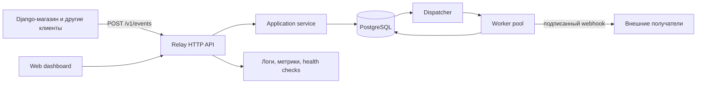

# Relay: план обучения Go через разработку полезного сервиса

## 1. Цель

Relay — самостоятельный сервис надёжной доставки событий по webhook.

Например, интернет-магазин сообщает Relay о создании заказа. Relay сохраняет
событие, определяет подписчиков, доставляет им HTTP-запросы и повторяет попытки,
если получатель временно недоступен.

Финальная версия должна уметь:

- принимать события через HTTP API;
- хранить события и подписки в PostgreSQL;
- создавать отдельную доставку для каждого подписчика;
- доставлять webhook параллельно, но с заданными ограничениями;
- использовать таймауты и повторные попытки с увеличивающейся задержкой;
- отправлять безнадёжные доставки в dead-letter queue;
- гарантировать идемпотентный приём событий;
- подписывать исходящие запросы;
- предоставлять API и веб-панель для просмотра состояния;
- собирать структурированные логи, метрики и диагностическую информацию;
- корректно запускаться, останавливаться, тестироваться и развёртываться;
- интегрироваться с существующим Django-магазином.

Это учебный проект, но мы будем относиться к нему как к настоящему сервису:
писать понятный код, тестировать поведение и принимать архитектурные решения
только тогда, когда для них появляется практическая причина.

## 2. Что означает «изучить Go»

Полный перечень учебных тем, их предпосылки, этапы первого применения,
критерии понимания и текущие статусы хранит
[`GO-KNOWLEDGE-MAP.md`](GO-KNOWLEDGE-MAP.md). Этот roadmap не заменяет карту:
он задаёт порядок продуктовых результатов Relay, а карта не позволяет скрыть
языковую предпосылку внутри большой задачи.

Мы изучим практически важную часть языка и стандартной библиотеки:

- модули, пакеты, импорт и правила видимости;
- базовые типы, константы, управляющие конструкции и zero values;
- массивы, slices, maps и строки;
- структуры, методы, указатели и композицию;
- функции, variadic-параметры, замыкания и функциональные опции;
- интерфейсы, type assertions и type switches;
- ошибки, wrapping, `errors.Is`, `errors.As` и `defer`;
- generics на задаче, где они действительно упрощают код;
- JSON, HTTP, потоки ввода-вывода и работу с файлами;
- `context.Context`, таймауты и отмену операций;
- goroutines, channels, `select` и примитивы пакета `sync`;
- SQL, транзакции и управление соединениями;
- unit-, integration-, table-driven и fuzz-тесты;
- benchmarks, race detector и профилирование;
- `go:embed`, сборку, конфигурацию и graceful shutdown.

Мы не будем искусственно добавлять `unsafe`, `cgo` или сложную рефлексию. Это
специализированные инструменты, отсутствие которых не делает Go-разработчика
менее подготовленным. Если в проекте появится реальная причина, рассмотрим их
отдельно.

## 3. Предполагаемая архитектура финальной версии



Основные сущности:

- **Event** — принятое событие, например `order.created`;
- **Subscription** — правило «какой тип события отправлять на какой URL»;
- **Delivery** — конкретная доставка события конкретному подписчику;
- **Attempt** — одна HTTP-попытка доставки с результатом и длительностью;
- **Dead letter** — доставка, исчерпавшая допустимое число попыток.

## 4. Как мы работаем на каждом этапе

Процесс поддерживается согласованными источниками:

- `doc/ROADMAP.md` задаёт продуктовые этапы и их порядок;
- `doc/GO-KNOWLEDGE-MAP.md` служит неблокирующим каталогом тем;
- `AGENTS.md` задаёт обязательные правила работы во всём репозитории;
- `.agents/skills/mentor-relay-go/SKILL.md` задаёт сценарий наставничества;
- текущий `doc/NN-name.md` хранит Core scope, инкременты, решения и ревью.

### Принципы темпа

- Этап строится вокруг одной работающей возможности Relay и обычно состоит из
  3–6 продуктовых инкрементов.
- В Core этапа выбирается примерно 5–12 концепций, без которых результат нельзя
  безопасно реализовать и объяснить.
- Связанные темы получают уровень Later или Reference и не задерживают этап.
- Две–четыре связанные концепции разрешено объяснять вместе, если они нужны для
  одного инкремента.
- Теория изучается just-in-time: подробно разбирается нужное сейчас, а не все
  варианты языка заранее.
- Реализация является основным доказательством понимания. Отдельная проверка до
  кода нужна только для действительно сложного или рискованного поведения.
- Если этап превысил шесть инкрементов или перестал давать видимый прогресс,
  scope пересматривается, а не расширяется автоматически.

Каждый продуктовый инкремент проходит компактный цикл:

1. Ментор объясняет продуктовую цель, необходимые Core-концепции, поток данных и
   проверяемый результат, затем выдаёт одно ограниченное задание.
2. Ученик реализует инкремент и сообщает, что готов к ревью.
3. Ментор проверяет корректность, идиоматичность, обработку ошибок, тесты и
   читаемость. Замечания делятся на обязательные и рекомендательные.
4. После ревью ментор задаёт 2–3 общих вопроса по важным решениям инкремента.
5. После исправлений запускаются проверки, а документ этапа обновляется один
   раз результатом реализации и ревью.

Предварительные упражнения используются для aliasing, `nil`, ошибок,
конкурентности, транзакций, отмены и владения ресурсами либо когда ученик явно
не понял объяснение. Обычный синтаксис закрепляется непосредственно в Relay.

Если тема оказалась сложной, мы не переходим дальше ради расписания. Делаем
маленькое дополнительное упражнение или упрощаем задачу и закрепляем материал.
Но незнание необязательных форм или редких деталей не удерживает этап открытым.

### Документ этапа

В начале каждого этапа ментор создаёт отдельный файл в `doc`:

```text
ветка stage/00-bootstrap       -> doc/00-bootstrap.md
ветка stage/03-http-api        -> doc/03-http-api.md
ветка stage/10-worker-pool     -> doc/10-worker-pool.md
```

Имя файла совпадает с содержательной частью имени ветки. Путь и имя остаются на
английском, чтобы с ними было удобно работать в Git и командной строке;
объяснения внутри документа пишутся по-русски.

Это краткий путеводитель и журнал решений, а не стенограмма обучения. Он
обновляется при старте этапа, после значимого инкремента или ревью и при
завершении. В нём находятся:

1. название, ветка и текущий статус этапа;
2. наблюдаемый результат этапа;
3. Core, Later и Reference scope;
4. план из 3–6 продуктовых инкрементов;
5. текущий инкремент и его критерий готовности;
6. важные объяснения и решения без повторения всей переписки;
7. результаты code review, проверки и исправления;
8. краткая ретроспектива и итоговая контрольная точка.

Ссылки на ID карты добавляются только когда помогают навигации. Глобальные
статусы обновляются после реального применения или обнаруженного пробела, а не
после каждого ответа.

Рекомендуемая структура файла:

```text
# Этап NN. Название

## Карточка этапа
## Результат этапа
## Учебный scope
## План инкрементов
## Текущий инкремент
## Необходимые объяснения и примеры
## Задание
## Решения и ход реализации
## Code review
## Проверки
## Ретроспектива
## Итог и контрольная точка
```

Статус меняется последовательно: `planned` -> `in progress` -> `review` ->
`done`. Замечания ревью не удаляются после исправления, а помечаются решёнными,
чтобы документ сохранял учебную историю. Код и завершённый документ этапа входят
в один принятый коммит. Принятая вершина ветки является контрольной точкой;
встраивать hash коммита в содержимое этого же коммита невозможно и не требуется.

### Git-процесс

Первый коммит с этим планом находится в `main`. Далее история развивается
линейно:

```text
main
  └── stage/00-bootstrap
        └── stage/01-domain-basics
              └── stage/02-domain-tests
                    └── ...
```

В начале этапа:

```bash
git switch -c stage/NN-short-name
```

Коммит создаётся только после ревью. Пример сообщения:

```text
feat: add event creation and validation
```

Ветки служат сохранёнными контрольными точками. После завершения проекта
актуальное состояние можно fast-forward объединить с `main` и отметить тегом
`v1.0.0`.

### Общее определение готовности этапа

- ученик может своими словами объяснить новый код;
- программа собирается и запускается;
- `gofmt` не оставляет изменений;
- `go vet ./...` завершается успешно;
- `go test ./...` завершается успешно;
- для конкурентного кода проходит `go test -race ./...`;
- ошибки не игнорируются без явной причины;
- публичное поведение отражено в тестах или документации;
- после ревью не осталось обязательных замечаний.

## 5. Этапы обучения

### Этап 00. Инструменты и первый исполняемый файл

**Ветка:** `stage/00-bootstrap`

**Результат:** репозиторий становится Go-модулем. Команда `go run ./cmd/relay`
запускает программу и выводит понятное сообщение о старте.

**Изучаем:**

- устройство Go SDK и команды `go version`, `go run`, `go build`;
- назначение `go.mod`;
- категории элементов синтаксиса, объявления, выражения и инструкции;
- блоки, локальную и пакетную области видимости, экспорт имён;
- `package main`, `import`, qualified identifier `pkg.Name` и `func main()`;
- переменные, короткое объявление `:=` и базовые типы;
- форматирование через `gofmt`;
- рекомендуемую структуру каталогов без преждевременного усложнения.

**Практика:**

- инициализировать модуль;
- создать `cmd/relay/main.go`;
- вывести имя и версию сервиса;
- добавить минимальный `README.md` с командами запуска.

**Готово, когда:** бинарный файл собирается, запускается и ученик понимает роль
каждой строки в `main.go`.

---

### Этап 01. Основы языка на модели события

**Ветка:** `stage/01-domain-basics`

**Результат:** в коде появляется тип `Event` и функция его создания с простой
валидацией. Событие хранит payload, время создания и текущий статус. Пока без
HTTP и базы данных.

**Core:**

- определённые строковые типы и typed-константы;
- структуры, поля и composite literals;
- функции с несколькими результатами и ранний возврат;
- `error`, `nil` и создание простой ошибки;
- value и pointer semantics на методах события;
- базовое использование `map[string]any` для payload;
- `time.Time` и создание timestamp через пакет `time`.

**Later:** JSON struct tags, глубокая семантика maps, строки/UTF-8, циклы,
`switch`, variadic-функции и wrapping ошибок. Они изучаются на этапах, где
впервые нужны для работающей возможности.

**Reference:** все формы числовых и других литералов, комплексные числа,
автоматическая вставка `;`, `goto` и другие детали спецификации, не используемые
моделью события.

**Практика:**

- определить `Event`, `EventType` и статус события;
- реализовать `NewEvent`;
- запретить пустой тип события;
- хранить произвольный JSON payload;
- записывать время создания события;
- вывести созданное событие из `main`.

**Ориентир:** 3–5 продуктовых инкрементов.

**Готово, когда:** модель события работает, проверки проходят, а ученик может
объяснить конструктор, ошибочный путь, отличие значения от указателя, роль
payload map и способ задания времени создания. Later и Reference не удерживают
этап открытым.

---

### Этап 02. Первые тесты

**Ветка:** `stage/02-domain-tests`

**Результат:** правила создания события защищены автоматическими тестами.

**Core:** файлы `*_test.go`, пакет `testing`, структура теста Arrange — Act —
Assert, базовые slice literals и `range`, map comma-ok, table-driven tests,
`t.Run`, sentinel-ошибки и `errors.Is`, небольшие helpers с `t.Helper`.

**Закрепляем:** структуры и composite literals, `(value, error)`, zero values,
maps в тестовых данных, value/pointer receiver и ранний возврат.

**Later:** `t.Parallel`, test doubles, измерение покрытия, fuzzing и подробная
семантика backing array. **Reference:** сторонние assertion-библиотеки, golden
files и искусственный обязательный процент покрытия.

**Инкременты:**

1. Защитить happy path `NewEvent`: тип, статус, наличие ключа payload через
   comma-ok и ненулевой `CreatedAt`.
2. Защитить ошибочный путь через общую sentinel-ошибку и `errors.Is`.
3. Объединить варианты типов и payload в table-driven test с `[]struct`,
   `range` и `t.Run`; явно зафиксировать допустимость nil payload.
4. Проверить `MarkDelivered` для обычного и nil receiver, выделить только
   действительно повторяющиеся проверки в helper и увидеть red-green цикл на
   намеренно внесённой учебной поломке.

**Готово, когда:** тесты защищают правила модели и переход статуса, падают при
намеренной регрессии и снова проходят после её устранения; ученик может
объяснить устройство таблицы тестов, цикл `range` и проверку ошибки.

---

### Этап 03. Первый HTTP API

**Ветка:** `stage/03-http-api`

**Результат:** Relay запускает HTTP-сервер, отвечает на `GET /health` и принимает
`POST /v1/events`.

**Core:** `net/http`, `http.Handler` и `http.ServeMux`, `Request` и
`ResponseWriter`, методы/заголовки/status codes, `encoding/json`, struct tags,
transport DTO, `json.Decoder`/`Encoder`, строки/UTF-8 на JSON-границе, JSON
numbers и ограничение floating point, обычный `switch`, `httptest`.

**Закрепляем:** конструктор и доменные ошибки, структуры, maps/`any`, ранние
возвраты, table-driven tests и разделение ответственности.

**Later:** middleware, аутентификация, idempotency, потоковый JSON и
настраиваемые marshalers. **Reference:** сторонние routers, WebSocket, HTTP/2 и
низкоуровневые интерфейсы вроде `Hijacker`.

**Инкременты:**

1. Создать тестируемый router и `GET /health` с простым JSON-ответом.
2. Описать request/response DTO и декодировать один JSON-объект, отклоняя
   неизвестные поля и некорректное тело; отдельно проверить Unicode-строку и
   выбрать безопасное представление JSON-числа без использования `float64` для
   денежных значений.
3. Реализовать `POST /v1/events`: преобразовать DTO в доменные значения,
   вызвать `NewEvent` и вернуть `201 Created`.
4. Сопоставить ожидаемые ошибки с `400 Bad Request` через небольшой `switch` и
   единый JSON error envelope.
5. Подключить router в `main` и проверить handlers через `httptest` без
   настоящего сетевого порта.

**Готово, когда:** health check отвечает успешно, корректный JSON получает
`201`, ошибочный — предсказуемый `400`, а HTTP-поведение защищено тестами.

---

### Этап 04. Хранилище в памяти и границы приложения

**Ветка:** `stage/04-memory-store`

**Результат:** события можно создавать, получать по ID и просматривать списком.
Данные пока живут только до перезапуска сервиса.

**Core:** границы пакетов и `internal`, экспортированный API, маленький
consumer-side interface и неявная реализация, method sets, композиция
зависимостей, repository/service/handler, `map` как индекс, slices и `append`,
`slices`/`maps` helpers, защитное копирование, `sync.RWMutex`, race detector.

**Закрепляем:** defined types через `EventID`, errors и `errors.Is`, JSON/HTTP,
table-driven tests, maps и pointer semantics.

**Later:** `context.Context` в repository, generics для коллекций, кеширование и
оптимистические блокировки. **Reference:** DI-контейнеры, reflection-based ORM,
полный DDD/Clean Architecture и lock-free структуры.

**Инкременты:**

1. Перенести модель события из `package main` в небольшой доменный пакет и
   определить стабильную границу с `EventID`.
2. Добавить application service и минимальный `EventRepository`, объявленный со
   стороны потребителя; подключить реализацию вручную в composition root.
3. Реализовать создание и получение события в памяти через map, sentinel
   `ErrNotFound` и `RWMutex`.
4. Реализовать детерминированный список через slice и вернуть копии, которые не
   позволяют вызывающему коду незаметно изменить хранилище.
5. Подключить `POST/GET /v1/events`, написать конкурентный тест и пройти
   `go test -race ./...`.

**Готово, когда:** событие создаётся, читается по ID и попадает в список,
transport не знает деталей хранения, а параллельные проверки проходят без race.

---

### Этап 05. Конфигурация и жизненный цикл сервера

**Ветка:** `stage/05-service-lifecycle`

**Результат:** сервис настраивается через окружение, пишет структурированные
логи и корректно завершает активные запросы.

**Core:** `os` и environment variables, структура конфигурации и валидация,
`time.Duration` и parsing, `log/slog`, `context.Context`, отмена, системные
сигналы, явный `http.Server`, server timeouts, `defer` и graceful shutdown.

**Закрепляем:** конструкторы, `(value, error)`, интерфейсные границы,
композицию зависимостей, HTTP-тесты и работу со временем.

**Later:** command-line flags, конфигурационные библиотеки, hot reload и
удалённые log collectors. **Reference:** детали сигналов разных ОС, systemd и
оркестраторы контейнеров.

**Инкременты:**

1. Загрузить порт и таймауты из окружения в типизированный `Config`, назначить
   defaults и вернуть понятные ошибки неверных значений.
2. Настроить `slog` и единый набор полей сервиса; провести request ID через
   обработчик без глобального изменяемого состояния.
3. Заменить скрытый запуск на явный `http.Server` с безопасными таймаутами и
   отдельной обработкой ошибки запуска.
4. Получить отменяемый context из `SIGINT`/`SIGTERM` и выполнить
   `Server.Shutdown` с ограниченным временем ожидания.
5. Тестом подтвердить, что принятый запрос завершается во время shutdown, а
   новые запросы больше не принимаются.

**Готово, когда:** Relay конфигурируется без изменения кода, пишет структурные
логи и завершает сервер предсказуемо, не теряя ошибки и активный запрос.

---

### Этап 06. PostgreSQL и постоянное хранение

**Ветка:** `stage/06-postgres`

**Результат:** события сохраняются между перезапусками Relay.

**Core:** внешний модуль и `go.sum`, PostgreSQL driver, `database/sql` и
connection pool, parameterized queries, `QueryRowContext`/`QueryContext`,
`Scan`, закрытие `Rows`, nullable-значения, wrapping ошибок через `%w`,
миграции и integration tests.

**Закрепляем:** repository interface и неявную реализацию, context/cancellation,
`defer`, errors, конфигурацию, slices при чтении нескольких строк и разделение
слоёв.

**Later:** SQL-транзакции до первой атомарной операции этапа 09, query builders,
code generation, ORM, тонкая настройка pool и уровни изоляции. **Reference:**
репликация, шардирование, распределённые транзакции и внутреннее устройство
PostgreSQL.

**Инкременты:**

1. Поднять PostgreSQL для разработки и применить версионируемую миграцию
   таблицы `events`.
2. Открыть и проверить `sql.DB`, настроить pool из `Config` и корректно закрыть
   ресурс при завершении приложения.
3. Реализовать `Create` и `Get` через параметры SQL, context и точное
   преобразование строк БД в доменные типы; добавить контекст к ошибке через
   `%w`, сохранив возможность `errors.Is`.
4. Реализовать `List`, корректно обработать `Rows`, порядок и nullable-поля без
   искусственной транзакции для одиночного чтения.
5. Запустить integration tests и переключить composition root между memory и
   PostgreSQL repository только конфигурацией.

**Готово, когда:** данные переживают перезапуск, SQL не строится конкатенацией,
а замена repository не требует изменений handler и application service.

---

### Этап 07. Подписки на события

**Ветка:** `stage/07-subscriptions`

**Результат:** клиент может зарегистрировать URL для выбранного типа события и
управлять подписками через API.

**Core:** моделирование `Subscription`, defined string types, `net/url`,
нормализация и валидация, выбор value/pointer API, связи и unique constraints в
PostgreSQL, query parameters, `strconv`, стабильная сортировка и cursor-based
pagination.

**Закрепляем:** конструкторы и инварианты, slices/`range`, maps, interfaces,
repository, SQL-транзакции, HTTP DTO и table-driven tests.

**Later:** wildcard-подписки, фильтры по payload, кеширование и полная история
изменений. **Reference:** регулярные выражения для сложных правил, GraphQL и
универсальные query builders.

**Инкременты:**

1. Создать доменную модель подписки с нормализованным URL, типом события и
   явным состоянием active/disabled.
2. Добавить миграцию и repository, запретив дублирующую активную подписку
   ограничением БД и понятной доменной ошибкой.
3. Реализовать создание и получение подписки через API.
4. Реализовать детерминированный список с `limit`/cursor и проверкой query
   parameters.
5. Добавить идемпотентное отключение подписки и интеграционные тесты ошибок,
   порядка и пагинации.

**Готово, когда:** некорректный URL и дубликат отклоняются, список стабилен и
постраничен, а отключённая подписка больше не считается активной.

---

### Этап 08. Первая доставка webhook

**Ветка:** `stage/08-webhook-sender`

**Результат:** Relay умеет отправить событие подписчику и вернуть структурный
результат попытки. На этом этапе доставка запускается явно, ещё не сохраняется
как надёжная очередь и не повторяется автоматически.

**Core:** переиспользуемый `http.Client`, создание исходящего `Request`, JSON
body как `io.Reader`, `io.ReadCloser` и `defer Body.Close`, timeout/cancellation,
ограниченное чтение ответа, маленький интерфейс отправителя, custom error type,
`errors.As`, классификация status codes через `switch`, `httptest.Server`.

**Закрепляем:** context, interfaces, JSON, headers, время/длительность, errors,
switch, dependency injection и тестирование HTTP без внешней сети.

**Later:** автоматические retries, подпись запроса, SSRF-защита и постоянная
очередь. **Reference:** устройство TCP/HTTP/2, собственный `RoundTripper`, proxy
и низкоуровневая настройка transport.

**Инкременты:**

1. Поднять управляемый тестовый receiver и отправить ему JSON события с
   обязательными служебными заголовками.
2. Ввести `WebhookSender` и результат попытки: status code, duration и
   ограниченный фрагмент response body.
3. Гарантировать закрытие body, лимит чтения и отмену запроса через context.
4. Разделить success, `4xx`, `5xx`, timeout и connection error на осмысленные
   результаты через `switch`, custom error и `errors.As`.
5. Вернуть результат попытки вызывающему application service, записать его в
   структурный лог и покрыть все классы результата тестами; постоянное хранение
   появится вместе с delivery queue.

**Готово, когда:** явный запуск доставки возвращает проверяемый результат, а
success, timeout, connection error, `4xx` и `5xx` воспроизводятся локальными
тестами без обращения во внешний интернет.

---

### Этап 09. Модель надёжной очереди и transactional outbox

**Ветка:** `stage/09-delivery-queue`

**Результат:** при приёме события в одной транзакции создаются само событие и
записи доставок для подходящих подписчиков. Сбой процесса больше не теряет
запланированную работу.

**Core:** конечный автомат и допустимые переходы, SQL transaction boundary,
atomicity/rollback, row locks, `FOR UPDATE SKIP LOCKED`, transactional outbox,
идемпотентность, timestamps очереди, транзакционные repository-операции и
integration tests с намеренным сбоем.

**Закрепляем:** методы с pointer receiver, `switch`, sentinel/custom errors,
interfaces, context, PostgreSQL constraints и тестирование отрицательных путей.

**Later:** функциональные опции для clock/ID только при реальной потребности,
приоритеты очереди и распределённые locks. **Reference:** exactly-once как
недостижимая общая гарантия, two-phase commit, Kafka и внешние брокеры.

**Состояния доставки:**

```text
pending -> processing -> succeeded
                    \-> retry_wait -> processing
                                  \-> dead
```

**Инкременты:**

1. Описать `Delivery` и проверить state machine переходов отдельными доменными
   тестами.
2. Создать таблицы `deliveries` и `delivery_attempts` с ограничениями состояний
   и уникальности.
3. В одной транзакции сохранять событие и deliveries для всех подходящих
   активных подписок.
4. Атомарно захватывать следующую работу через row lock, не выдавая одну
   delivery двум workers.
5. Интеграционными тестами доказать rollback при искусственной ошибке,
   отсутствие частичных данных и идемпотентное повторение команды.

**Готово, когда:** после подтверждённого приёма события запланированная работа не
теряется, параллельный claim не дублирует delivery, а сбой транзакции не
оставляет частичного состояния.

---

### Этап 10. Goroutines и worker pool

**Ветка:** `stage/10-worker-pool`

**Результат:** несколько workers параллельно забирают ожидающие доставки и
отправляют webhook. Количество одновременно выполняемых запросов ограничено.

**Core:** goroutine и её жизненный цикл, unbuffered/buffered channels,
направление channel в сигнатуре, владение закрытием channel, `select`,
`sync.WaitGroup`, bounded concurrency, backpressure, context cancellation,
goroutine leak/deadlock и race detector.

**Закрепляем:** interfaces, repository claim, webhook sender, errors, context,
graceful shutdown, table-driven и integration tests.

**Later:** `sync.Once`, atomics, обобщённые fan-in/fan-out helpers и внешний
`errgroup`. **Reference:** детали scheduler, lock-free algorithms и полная модель
памяти Go за пределами нужных happens-before связей.

**Инкременты:**

1. Реализовать один worker loop, который получает delivery и завершает работу
   по закрытию входа или отмене context.
2. Запустить фиксированное число workers и дождаться их через `WaitGroup`.
3. Добавить ограниченный buffered channel и явно проверить backpressure вместо
   неограниченного накопления goroutines.
4. Соединить dispatcher, queue claim и sender; определить единственного
   владельца закрытия channel и корректный порядок shutdown.
5. Нагрузочным тестом подтвердить лимит конкурентности, отсутствие двойной
   обработки, зависаний, goroutine leaks и data races.

**Готово, когда:** много deliveries обрабатываются параллельно в заданном
лимите, остановка завершается, а тесты стабильно проходят с `-race`.

---

### Этап 11. Повторные попытки и dead-letter queue

**Ветка:** `stage/11-retries`

**Результат:** временные ошибки повторяются по расписанию, постоянные ошибки и
исчерпанные доставки переводятся в состояние `dead`.

**Core:** `time.Duration`, `Timer`/`Ticker` по фактической роли, exponential
backoff, ограниченный jitter, чистая функция расписания, внедрение clock/random
через маленький интерфейс или функцию, closures, `Retry-After`, классификация
ошибок, persisted `next_attempt_at` и состояние `dead`.

**Закрепляем:** time, interfaces, switch, custom errors, SQL state machine,
worker pool, context cancellation и детерминированные тесты.

**Later:** универсальный scheduler, heap приоритетов, cron и адаптивные retry
алгоритмы. **Reference:** математическое моделирование jitter и внешние
планировщики задач.

**Инкременты:**

1. Реализовать чистую retry policy: номер попытки → delay/dead без ожиданий и
   побочных эффектов.
2. Добавить jitter и `Retry-After` с управляемыми источниками времени и
   случайности, чтобы тесты оставались детерминированными.
3. После временной ошибки сохранять `retry_wait` и `next_attempt_at`, а после
   постоянной или исчерпанной — `dead`.
4. Научить dispatcher выбирать только наступившие retries и просыпаться без
   busy loop, корректно реагируя на context.
5. Добавить просмотр и ручной retry dead-delivery; интеграционным тестом
   подтвердить сохранение расписания после перезапуска.

**Готово, когда:** retries выполняются по сохранённому расписанию, тесты не ждут
реальные секунды, а permanent/exhausted доставки управляемо попадают в DLQ.

---

### Этап 12. Устойчивый публичный API

**Ветка:** `stage/12-api-hardening`

**Результат:** API имеет единый формат ошибок, аутентификацию, идемпотентность,
лимиты и удобную пагинацию.

**Core:** функции как значения и higher-order middleware, closures, variadic
middleware chain и `slice...`, typed context key, type assertion и ограниченный
type switch, recovery на внешней границе, generic `Page[T]`, единый error
envelope, API key и constant-time comparison, persisted idempotency key, rate
limiting, request/response limits и контрактные тесты.

**Закрепляем:** handlers, interfaces, context, maps/slices, SQL constraints,
structured logging, errors и конкурентную безопасность.

**Later:** OAuth/OIDC, JWT, distributed rate limiter и автоматическая генерация
OpenAPI. **Reference:** custom generic constraints с union/`~`,
reflection-based web frameworks и полная теория распределённой
идемпотентности.

**Инкременты:**

1. Ввести единый error envelope и собрать variadic middleware chain, включая
   recovery, который не раскрывает stack trace клиенту, но сохраняет ошибку в
   логах.
2. Перенести существующий request ID в middleware с typed context key и type
   assertion, связать его с логами и ответами; отдельным малым project
   experiment разобрать type switch над ограниченным набором значений `any`, не
   добавляя его в production без необходимости.
3. Добавить API key middleware с constant-time comparison и тестами
   отсутствующего/неверного/верного ключа.
4. Ограничить body и ответы, вернуть pagination metadata через `Page[T]` для
   событий, подписок и deliveries.
5. Сохранить idempotency key события в БД и возвращать прежний результат при
   безопасном повторе запроса.
6. Добавить локальный rate limiter и набор contract tests на формат ошибок,
   заголовки, лимиты и обратную совместимость.

**Готово, когда:** повтор запроса с тем же ключом не создаёт дубликат, доступ
защищён, лимиты предсказуемы, а внешние ошибки не содержат внутренних деталей.

---

### Этап 13. Безопасная доставка

**Ветка:** `stage/13-delivery-security`

**Результат:** получатель может проверить подлинность webhook, а Relay защищён от
очевидных злоупотреблений исходящими запросами.

**Core:** краткая threat model, exact request bytes, `crypto/hmac`,
`crypto/sha256` и массив результата `Sum256`, hex/base64 encoding, constant-time
verification, timestamp и delivery ID против replay, ротация секретов, DNS
resolution, классификация IP ranges, SSRF, redirect policy и bounded bodies.

**Закрепляем:** arrays/slices на байтах и результате hash, interfaces,
`http.Client`, custom errors, time, configuration, table-driven tests и
безопасное владение секретами.

**Later:** mTLS, secrets manager, OAuth для исходящей доставки и allowlist по
клиентам. **Reference:** полная PKI, certificate pinning, WAF и формальная
криптографическая верификация.

**Инкременты:**

1. Записать модель угроз: какие данные и границы защищаем, какие атаки входят и
   не входят в scope.
2. Подписать точные bytes тела вместе с timestamp и delivery ID; дать
   тестовому receiver функцию проверки подписи.
3. Отклонять изменённое тело, старый timestamp и повтор delivery ID; поддержать
   безопасное окно ротации двух секретов.
4. До соединения разрешать hostname, проверять все полученные IP и запрещать
   loopback/link-local/private ranges по политике Relay.
5. Запретить небезопасные redirects, повторять проверку адреса на каждом
   переходе и покрыть сценарии локальным DNS/HTTP test setup.

**Готово, когда:** корректный receiver подтверждает подпись, tampering/replay
отклоняются, а запрещённый адрес или redirect не приводит к исходящему запросу.

---

### Этап 14. Веб-панель

**Ветка:** `stage/14-dashboard`

**Результат:** в браузере видны события, подписки, попытки, ошибки и состояние
очереди; dead-доставку можно повторить вручную.

**Core:** `html/template` и autoescaping, parsing/execution шаблонов, template
composition, view models, `embed.FS`/`go:embed`, static files, HTML forms,
POST/Redirect/GET, CSRF и reuse application service.

**Закрепляем:** HTTP routes/methods, slices и pagination, generics `Page[T]`,
context, middleware, security headers и разделение transport/business logic.

**Later:** SPA, JavaScript framework, live updates и внешний asset pipeline.
**Reference:** собственный template engine, frontend state management и SSR
frameworks.

**Инкременты:**

1. Встроить базовый layout, templates и static assets в бинарный файл.
2. Показать список событий и deliveries через отдельные view models и
   существующий application service.
3. Добавить страницу деталей с попытками, ошибками и безопасно экранированным
   payload/response fragment.
4. Добавить фильтры и пагинацию без дублирования query-логики API.
5. Реализовать Retry как защищённый CSRF-токеном POST с Redirect/Get и проверкой
   прав доступа.

**Готово, когда:** dashboard показывает состояние очереди, безопасно повторяет
dead-delivery, не содержит отдельной бизнес-логики и входит в один бинарник.

---

### Этап 15. Наблюдаемость, диагностика и производительность

**Ветка:** `stage/15-observability`

**Результат:** состояние Relay можно оценить без чтения исходного кода, а узкие
места можно измерить.

**Core:** correlation IDs в structured logs, counter/gauge/histogram, labels с
контролируемой cardinality, liveness/readiness, runtime metrics, Go benchmarks,
`-benchmem`, fuzz tests, CPU/heap profiling через `pprof`, нагрузочный сценарий и
измеряемая оптимизация.

**Закрепляем:** slog, middleware, generics/collections, concurrency, race
detector, context, HTTP/DB boundaries и обработку недоверенного ввода.

**Later:** distributed tracing/OpenTelemetry, внешние dashboards и alerting.
**Reference:** внутреннее устройство GC/scheduler, custom metrics backend и
микрооптимизации без профиля.

**Инкременты:**

1. Провести event/request/delivery IDs через структурные логи и проследить одну
   доставку от API до результата.
2. Добавить метрики принятых событий, outcomes, latency и длины очереди без
   неограниченных labels.
3. Разделить liveness и readiness; readiness должна действительно проверять
   критические зависимости с коротким timeout.
4. Написать benchmark горячего участка, снять allocations через `-benchmem` и
   сохранить baseline до изменений.
5. Добавить fuzz test для JSON boundary или parser подписи и устранить найденные
   panic/неконтролируемые расходы.
6. Снять CPU/heap profile под воспроизводимой нагрузкой и выполнить не более
   одной оптимизации, подтверждённой повторным измерением.

**Готово, когда:** состояние сервиса видно по логам/метрикам/health checks, а
объяснение производительности опирается на benchmark и profile, а не догадки.

---

### Этап 16. Финальная интеграция и выпуск

**Ветка:** `stage/16-release`

**Результат:** Relay собирается воспроизводимо, запускается в контейнере и
получает реальные события от Django-магазина.

**Core:** multi-stage Docker build, минимальный runtime image, build flags и
version metadata, CI для format/vet/tests/race, миграции при deployment,
development/production configuration, semantic versioning, API compatibility,
end-to-end tests, эксплуатационный README и release checklist.

**Закрепляем:** весь поток HTTP → transaction → queue → worker → signed webhook,
ошибки и retries, security, observability, Git checkpoints и интеграцию с
знакомым Django-приложением.

**Later:** Kubernetes, автоматический CD, high availability и managed secrets.
**Reference:** multi-region deployment, canary/blue-green orchestration и
формальные SLO/error budgets.

**Инкременты:**

1. Собрать версионируемый статический бинарник multi-stage Dockerfile и
   проверить запуск непривилегированным пользователем.
2. Подготовить воспроизводимое локальное окружение Relay + PostgreSQL + test
   receiver и явный шаг применения миграций.
3. Настроить CI: форматирование, vet, unit/integration tests, race detector,
   build и проверка миграций.
4. В Django-магазине реализовать небольшой publisher для `order.created`,
   `order.paid` и `order.cancelled` по документированному контракту Relay.
5. Провести end-to-end сценарии success, timeout/`5xx`, retry, подписи и
   отображения результата в dashboard/metrics.
6. Проверить README с чистого окружения, подготовить changelog/release checklist
   и только после отдельного подтверждения создать тег `v1.0.0`.

**Готово, когда:** новый разработчик по README поднимает систему, создаёт
подписку, отправляет событие из Django и видит подтверждённую либо корректно
повторённую доставку со сквозной диагностикой.

## 6. Контрольные версии продукта

Чтобы прогресс оставался видимым, этапы объединены в полезные версии:

| Версия | Этапы | Что уже можно показать |
|---|---:|---|
| `v0.1` | 00–03 | HTTP API принимает и валидирует событие |
| `v0.2` | 04–06 | события надёжно хранятся в PostgreSQL |
| `v0.3` | 07–08 | подписки получают первые webhook |
| `v0.5` | 09–11 | работает постоянная очередь, workers и retries |
| `v0.7` | 12–13 | API и доставка защищены |
| `v0.9` | 14–15 | есть dashboard, метрики и диагностика |
| `v1.0` | 16 | готовый сервис интегрирован с Django-магазином |

## 7. Правила наставничества и ревью

Во время ревью ментор проверяет код в таком порядке:

1. **Correctness:** выполняет ли код требуемое поведение.
2. **Safety:** нет ли потерь данных, races, утечек ресурсов и секретов.
3. **Clarity:** можно ли понять код без догадок и лишних комментариев.
4. **Go idioms:** естественно ли используются ошибки, интерфейсы и concurrency.
5. **Tests:** защищают ли тесты поведение, а не детали реализации.
6. **Design:** оправдана ли сложность текущими требованиями.

Мы не вводим абстракцию «на будущее». Сначала пишем простое конкретное решение,
затем замечаем повторение или необходимость замены и только после этого выделяем
интерфейс или общий компонент.

Типичные вопросы после этапа:

- что произойдёт на ошибочном или граничном входе;
- кто владеет ресурсом и кто обязан его закрыть;
- может ли функция выполняться одновременно из нескольких goroutines;
- почему выбран указатель, значение или интерфейс;
- как тест доказывает требуемое поведение;
- что произойдёт при перезапуске процесса в неудачный момент.

## 8. Текущая контрольная точка

Этап 01 завершён в ветке `stage/01-domain-basics` и принят коммитом
`1d75ab8 feat: add event domain model`. Модель события хранит тип, статус,
payload и время создания; успешный и ошибочный пути показаны в `main`.
Подробный итог находится в [`01-domain-basics.md`](01-domain-basics.md).

После перехода на feature-first схему три оставшихся инкремента этапа были
завершены примерно за 3,3 дня вместо прежнего темпа около двух инкрементов за
11 дней. Ревью при этом обнаружило реальные пробелы в понимании map, времени и
полей события, и каждый был устранён до приёмки.

Следующим является этап 02 — первые автоматические тесты. Его ветка и
`02-domain-tests.md` создаются только по отдельной просьбе ученика. Тему выбирает
текущий продуктовый инкремент, а глобальная карта используется для навигации и
запланированного повторения, не как линейный gate.
