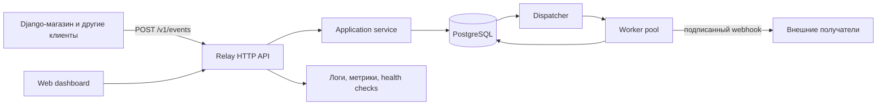

# Relay: план обучения Go через разработку полезного сервиса

## 1. Цель

Relay — самостоятельный сервис надёжной доставки событий по webhook.

Например, интернет-магазин сообщает Relay о создании заказа. Relay сохраняет
событие, определяет подписчиков, доставляет им HTTP-запросы и повторяет попытки,
если получатель временно недоступен.

Финальная версия должна уметь:

- принимать события через HTTP API;
- хранить события и подписки в PostgreSQL;
- создавать отдельную доставку для каждого подписчика;
- доставлять webhook параллельно, но с заданными ограничениями;
- использовать таймауты и повторные попытки с увеличивающейся задержкой;
- отправлять безнадёжные доставки в dead-letter queue;
- гарантировать идемпотентный приём событий;
- подписывать исходящие запросы;
- предоставлять API и веб-панель для просмотра состояния;
- собирать структурированные логи, метрики и диагностическую информацию;
- корректно запускаться, останавливаться, тестироваться и развёртываться;
- интегрироваться с существующим Django-магазином.

Это учебный проект, но мы будем относиться к нему как к настоящему сервису:
писать понятный код, тестировать поведение и принимать архитектурные решения
только тогда, когда для них появляется практическая причина.

## 2. Что означает «изучить Go»

Мы изучим практически важную часть языка и стандартной библиотеки:

- модули, пакеты, импорт и правила видимости;
- базовые типы, константы, управляющие конструкции и zero values;
- массивы, slices, maps и строки;
- структуры, методы, указатели и композицию;
- функции, variadic-параметры, замыкания и функциональные опции;
- интерфейсы, type assertions и type switches;
- ошибки, wrapping, `errors.Is`, `errors.As` и `defer`;
- generics на задаче, где они действительно упрощают код;
- JSON, HTTP, потоки ввода-вывода и работу с файлами;
- `context.Context`, таймауты и отмену операций;
- goroutines, channels, `select` и примитивы пакета `sync`;
- SQL, транзакции и управление соединениями;
- unit-, integration-, table-driven и fuzz-тесты;
- benchmarks, race detector и профилирование;
- `go:embed`, сборку, конфигурацию и graceful shutdown.

Мы не будем искусственно добавлять `unsafe`, `cgo` или сложную рефлексию. Это
специализированные инструменты, отсутствие которых не делает Go-разработчика
менее подготовленным. Если в проекте появится реальная причина, рассмотрим их
отдельно.

## 3. Предполагаемая архитектура финальной версии



Основные сущности:

- **Event** — принятое событие, например `order.created`;
- **Subscription** — правило «какой тип события отправлять на какой URL»;
- **Delivery** — конкретная доставка события конкретному подписчику;
- **Attempt** — одна HTTP-попытка доставки с результатом и длительностью;
- **Dead letter** — доставка, исчерпавшая допустимое число попыток.

## 4. Как мы работаем на каждом этапе

Процесс защищён тремя уровнями инструкций:

- `AGENTS.md` задаёт обязательные правила работы во всём репозитории;
- `.agents/skills/mentor-relay-go/SKILL.md` задаёт сценарий наставничества;
- текущий `doc/NN-name.md` хранит полный процесс конкретного этапа.

Каждый этап проходит одинаково:

1. Ментор объясняет результат этапа, новые понятия и их место в сервисе.
2. Ментор показывает небольшие примеры кода, но не выдаёт целиком готовое
   решение.
3. Ученик реализует задачу и сообщает, что готов к ревью.
4. Ментор проверяет корректность, идиоматичность, обработку ошибок, тесты и
   читаемость. Замечания делятся на обязательные и рекомендательные.
5. Ментор задаёт несколько вопросов по использованным концепциям. Это не
   экзамен: вопросы нужны, чтобы обнаружить непонятые места.
6. После исправлений запускаются проверки этапа.
7. Если результат понятен и критерии выполнены, создаётся коммит.
8. Следующая ветка создаётся от принятого состояния текущего этапа.

Если тема оказалась сложной, мы не переходим дальше ради расписания. Делаем
маленькое дополнительное упражнение или упрощаем задачу и закрепляем материал.

### Документ этапа

В начале каждого этапа ментор создаёт отдельный файл в `doc`:

```text
ветка stage/00-bootstrap       -> doc/00-bootstrap.md
ветка stage/03-http-api        -> doc/03-http-api.md
ветка stage/10-worker-pool     -> doc/10-worker-pool.md
```

Имя файла совпадает с содержательной частью имени ветки. Путь и имя остаются на
английском, чтобы с ними было удобно работать в Git и командной строке;
объяснения внутри документа пишутся по-русски.

Это живой документ, который хранит весь процесс этапа, а не только начальное
задание. Он создаётся до написания кода, дополняется во время работы и
завершается после ревью. В нём находятся:

1. название, ветка и текущий статус этапа;
2. исходное состояние и необходимые знания;
3. понятное описание цели и ожидаемого поведения;
4. объяснение новых концепций Go и причин их применения;
5. небольшие примеры кода, не содержащие целиком готового решения;
6. пошаговое задание для самостоятельной реализации;
7. критерии приёмки и команды проверки;
8. принятые по ходу реализации решения и причины выбора;
9. вопросы ученика и важные пояснения ментора;
10. результаты code review: обязательные замечания, рекомендации и исправления;
11. контрольные вопросы и краткие выводы ученика;
12. итог этапа, результаты проверок и согласованное сообщение коммита.

Рекомендуемая структура файла:

```text
# Этап NN. Название

## Карточка этапа
## Что и зачем реализуем
## Новые концепции Go
## Примеры
## Задание
## Критерии приёмки
## Ход реализации и решения
## Вопросы и пояснения
## Code review
## Контрольные вопросы
## Проверки
## Итог и контрольная точка
```

Статус меняется последовательно: `planned` -> `in progress` -> `review` ->
`done`. Замечания ревью не удаляются после исправления, а помечаются решёнными,
чтобы документ сохранял учебную историю. Код и завершённый документ этапа входят
в один принятый коммит. Принятая вершина ветки является контрольной точкой;
встраивать hash коммита в содержимое этого же коммита невозможно и не требуется.

### Git-процесс

Первый коммит с этим планом находится в `main`. Далее история развивается
линейно:

```text
main
  └── stage/00-bootstrap
        └── stage/01-domain-basics
              └── stage/02-domain-tests
                    └── ...
```

В начале этапа:

```bash
git switch -c stage/NN-short-name
```

Коммит создаётся только после ревью. Пример сообщения:

```text
feat: add event creation and validation
```

Ветки служат сохранёнными контрольными точками. После завершения проекта
актуальное состояние можно fast-forward объединить с `main` и отметить тегом
`v1.0.0`.

### Общее определение готовности этапа

- ученик может своими словами объяснить новый код;
- программа собирается и запускается;
- `gofmt` не оставляет изменений;
- `go vet ./...` завершается успешно;
- `go test ./...` завершается успешно;
- для конкурентного кода проходит `go test -race ./...`;
- ошибки не игнорируются без явной причины;
- публичное поведение отражено в тестах или документации;
- после ревью не осталось обязательных замечаний.

## 5. Этапы обучения

### Этап 00. Инструменты и первый исполняемый файл

**Ветка:** `stage/00-bootstrap`

**Результат:** репозиторий становится Go-модулем. Команда `go run ./cmd/relay`
запускает программу и выводит понятное сообщение о старте.

**Изучаем:**

- устройство Go SDK и команды `go version`, `go run`, `go build`;
- назначение `go.mod`;
- `package main`, `import` и `func main()`;
- переменные, короткое объявление `:=` и базовые типы;
- форматирование через `gofmt`;
- рекомендуемую структуру каталогов без преждевременного усложнения.

**Практика:**

- инициализировать модуль;
- создать `cmd/relay/main.go`;
- вывести имя и версию сервиса;
- добавить минимальный `README.md` с командами запуска.

**Готово, когда:** бинарный файл собирается, запускается и ученик понимает роль
каждой строки в `main.go`.

---

### Этап 01. Основы языка на модели события

**Ветка:** `stage/01-domain-basics`

**Результат:** в коде появляется тип `Event` и функция его создания с простой
валидацией. Пока без HTTP и базы данных.

**Изучаем:**

- значения и zero values;
- `const`, `if`, `switch`, `for`;
- структуры и теги полей;
- функции и возврат нескольких значений;
- методы с value- и pointer-receiver;
- строки, slices и maps;
- пакет `time`;
- значение `nil`;
- создание и оборачивание ошибок через `fmt.Errorf`.

**Практика:**

- определить `Event`, `EventType` и статус события;
- реализовать `NewEvent`;
- запретить пустой тип события;
- хранить произвольный JSON payload;
- вывести созданное событие из `main`.

**Готово, когда:** ученик объясняет, чем значение отличается от указателя, когда
map может быть `nil` и почему конструктор возвращает ошибку.

---

### Этап 02. Первые тесты

**Ветка:** `stage/02-domain-tests`

**Результат:** правила создания события защищены автоматическими тестами.

**Изучаем:**

- файлы `*_test.go` и пакет `testing`;
- table-driven tests;
- под-тесты через `t.Run`;
- сравнение ожидаемого и фактического результата;
- `t.Helper` для вспомогательных проверок;
- тестирование ошибок через `errors.Is`;
- принцип Arrange — Act — Assert.

**Практика:** проверить корректное событие, пустой тип, пустой payload и
несколько разных типов событий.

**Готово, когда:** тест действительно падает при намеренной поломке валидации и
снова проходит после исправления.

---

### Этап 03. Первый HTTP API

**Ветка:** `stage/03-http-api`

**Результат:** Relay запускает HTTP-сервер, отвечает на `GET /health` и принимает
`POST /v1/events`.

**Изучаем:**

- `net/http`, handler и `http.ServeMux`;
- HTTP-методы, заголовки и status codes;
- чтение тела запроса как потока;
- кодирование и декодирование JSON;
- struct tags;
- ранний возврат из функции;
- разделение transport-модели и доменной модели;
- базовые HTTP-тесты через `httptest`.

**Практика:**

- реализовать health endpoint;
- декодировать запрос создания события;
- валидировать данные через доменную функцию;
- возвращать единый JSON-формат успешного ответа и ошибки;
- ограничить неизвестные поля JSON.

**Готово, когда:** корректный запрос получает `201 Created`, ошибочный — `400
Bad Request`, а handler проверен без запуска реального сетевого порта.

---

### Этап 04. Хранилище в памяти и границы приложения

**Ветка:** `stage/04-memory-store`

**Результат:** события можно создавать, получать по ID и просматривать списком.
Данные пока живут только до перезапуска сервиса.

**Изучаем:**

- пакеты и правила видимости идентификаторов;
- интерфейсы и их неявную реализацию;
- композицию зависимостей;
- разделение handler, service и repository;
- slices, maps и копирование данных;
- `sync.RWMutex`;
- почему HTTP-handler уже выполняется конкурентно;
- собственные sentinel-ошибки и `errors.Is`.

**Практика:**

- создать in-memory repository;
- реализовать `POST /v1/events`, `GET /v1/events` и
  `GET /v1/events/{id}`;
- защитить общие данные от data race;
- написать тесты repository, service и handler.

**Готово, когда:** API работает при параллельных запросах, а тесты проходят с
race detector.

---

### Этап 05. Конфигурация и жизненный цикл сервера

**Ветка:** `stage/05-service-lifecycle`

**Результат:** сервис настраивается через окружение, пишет структурированные
логи и корректно завершает активные запросы.

**Изучаем:**

- `os`, переменные окружения и аргументы процесса;
- структуру конфигурации и значения по умолчанию;
- `log/slog`;
- `context.Context`;
- системные сигналы;
- `http.Server` и graceful shutdown;
- `defer` и порядок освобождения ресурсов;
- назначение таймаутов сервера.

**Практика:** добавить порт и таймауты в конфигурацию, request ID в логи,
обработку `SIGINT`/`SIGTERM` и контролируемое завершение.

**Готово, когда:** остановка сервиса не обрывает уже принятый тестовый запрос и
ошибки запуска не теряются.

---

### Этап 06. PostgreSQL и постоянное хранение

**Ветка:** `stage/06-postgres`

**Результат:** события сохраняются между перезапусками Relay.

**Изучаем:**

- подключение внешнего модуля и содержимое `go.sum`;
- `database/sql` и PostgreSQL-драйвер;
- connection pool;
- параметры SQL-запросов;
- `Scan`, nullable-значения и преобразование типов;
- транзакции;
- миграции схемы;
- проброс `context.Context` в операции ввода-вывода;
- integration tests.

**Практика:**

- поднять PostgreSQL для разработки;
- создать миграцию таблицы `events`;
- реализовать PostgreSQL repository за уже существующим интерфейсом;
- выбирать реализацию repository через конфигурацию;
- протестировать сохранение и чтение на настоящей БД.

**Готово, когда:** замена памяти на PostgreSQL не требует изменения HTTP-handler
и application service.

---

### Этап 07. Подписки на события

**Ветка:** `stage/07-subscriptions`

**Результат:** клиент может зарегистрировать URL для выбранного типа события и
управлять подписками через API.

**Изучаем:**

- моделирование предметной области;
- пользовательские типы поверх строк;
- нормализацию и валидацию URL;
- методы коллекций;
- связи и ограничения в PostgreSQL;
- пагинацию и параметры query string;
- выбор между указателем и значением в API.

**Практика:** добавить `Subscription`, миграцию и endpoints создания, просмотра,
списка и отключения подписки.

**Готово, когда:** нельзя создать некорректную или дублирующую активную подписку,
а список имеет предсказуемый порядок и пагинацию.

---

### Этап 08. Первая доставка webhook

**Ветка:** `stage/08-webhook-sender`

**Результат:** Relay умеет отправить событие подписчику и записать результат
попытки. На этом этапе доставка запускается явно и ещё не является надёжной
очередью.

**Изучаем:**

- `http.Client` и повторное использование соединений;
- создание исходящего HTTP-запроса;
- `io.Reader`, `io.ReadCloser` и `defer Body.Close()`;
- таймаут и отмену через context;
- интерфейс клиента для тестирования;
- custom errors и классификацию ответов;
- `errors.As` и временные сетевые ошибки;
- тестовый сервер через `httptest.Server`.

**Практика:** отправить JSON, добавить служебные заголовки, ограничить размер
считываемого ответа и сохранить status code, длительность и короткий фрагмент
ответа.

**Готово, когда:** success, timeout, connection error и ответы `4xx`/`5xx`
проверены тестами.

---

### Этап 09. Модель надёжной очереди и transactional outbox

**Ветка:** `stage/09-delivery-queue`

**Результат:** при приёме события в одной транзакции создаются само событие и
записи доставок для подходящих подписчиков. Сбой процесса больше не теряет
запланированную работу.

**Изучаем:**

- инварианты и конечный автомат состояний;
- границы SQL-транзакции;
- atomicity и rollback;
- блокировки строк;
- паттерн transactional outbox;
- идемпотентность операций;
- интерфейсы, принимающие `*sql.Tx` или абстракцию транзакции;
- функциональные опции там, где они улучшают тестируемость.

**Состояния доставки:**

```text
pending -> processing -> succeeded
                    \-> retry_wait -> processing
                                  \-> dead
```

**Практика:** создать таблицы `deliveries` и `delivery_attempts`, создать
доставки вместе с событием и реализовать безопасное получение следующей работы.

**Готово, когда:** искусственная ошибка в середине транзакции не оставляет
частично сохранённых данных.

---

### Этап 10. Goroutines и worker pool

**Ветка:** `stage/10-worker-pool`

**Результат:** несколько workers параллельно забирают ожидающие доставки и
отправляют webhook. Количество одновременно выполняемых запросов ограничено.

**Изучаем:**

- goroutines и их жизненный цикл;
- unbuffered и buffered channels;
- направление channel в сигнатуре;
- `select`;
- `sync.WaitGroup`, `sync.Once`, mutex и atomic operations;
- backpressure;
- отмену группы workers через context;
- причины goroutine leak и deadlock;
- race detector.

**Практика:** реализовать dispatcher, настраиваемый worker pool, корректную
остановку и отсутствие двойной обработки одной доставки.

**Готово, когда:** тест одновременно обрабатывает много доставок, соблюдает
лимит конкурентности и завершается без утечек и data races.

---

### Этап 11. Повторные попытки и dead-letter queue

**Ветка:** `stage/11-retries`

**Результат:** временные ошибки повторяются по расписанию, постоянные ошибки и
исчерпанные доставки переводятся в состояние `dead`.

**Изучаем:**

- `time.Timer`, `time.Ticker` и аккуратное управление ими;
- exponential backoff и jitter;
- стратегию как интерфейс;
- чистые функции и детерминированные тесты времени;
- замыкания;
- классификацию ошибок;
- сохранение состояния между перезапусками.

**Практика:** задать максимальное число попыток, вычислять `next_attempt_at`,
уважать заголовок `Retry-After` и добавить ручной повтор dead-доставки.

**Готово, когда:** тесты не используют реальные многосекундные ожидания, а
перезапуск процесса не сбрасывает расписание.

---

### Этап 12. Устойчивый публичный API

**Ветка:** `stage/12-api-hardening`

**Результат:** API имеет единый формат ошибок, аутентификацию, идемпотентность,
лимиты и удобную пагинацию.

**Изучаем:**

- middleware как функцию высшего порядка;
- функции как значения и замыкания;
- цепочку middleware;
- type assertion для значений context;
- recovery от panic только на внешней границе процесса;
- generics на примере `Page[T]` и общих JSON-ответов;
- rate limiting;
- постоянное сравнение секретов;
- контракт API и обратную совместимость.

**Практика:** добавить API keys, idempotency key для событий, request/response
limits, pagination metadata, request ID и единый error envelope.

**Готово, когда:** повтор одного события с тем же ключом не создаёт дубликаты, а
ошибки не раскрывают внутренние детали сервиса.

---

### Этап 13. Безопасная доставка

**Ветка:** `stage/13-delivery-security`

**Результат:** получатель может проверить подлинность webhook, а Relay защищён от
очевидных злоупотреблений исходящими запросами.

**Изучаем:**

- HMAC из `crypto/hmac` и `crypto/sha256`;
- безопасное хранение и сравнение секретов;
- особенности DNS, IP-адресов и redirects;
- SSRF и защита приватных сетей;
- ограничение размера тела;
- ротацию секретов;
- модель угроз как часть проектирования.

**Практика:** подписывать тело запроса, передавать timestamp и delivery ID,
проверять URL назначения, контролировать redirects и документировать алгоритм
проверки подписи.

**Готово, когда:** тестовый получатель проверяет подпись, изменённое тело не
проходит проверку, а запрещённые адреса отклоняются до сетевого запроса.

---

### Этап 14. Веб-панель

**Ветка:** `stage/14-dashboard`

**Результат:** в браузере видны события, подписки, попытки, ошибки и состояние
очереди; dead-доставку можно повторить вручную.

**Изучаем:**

- `html/template` и автоматическое экранирование;
- `embed.FS` и директиву `go:embed`;
- работу со статическими файлами;
- view models;
- композицию шаблонов;
- CSRF для изменяющих состояние действий;
- reuse application service между API и HTML-handler.

**Практика:** сделать список событий и доставок, страницу деталей, фильтры по
статусу и безопасное действие Retry.

**Готово, когда:** панель не содержит отдельной бизнес-логики, корректно
экранирует данные webhook и встраивается в один бинарный файл.

---

### Этап 15. Наблюдаемость, диагностика и производительность

**Ветка:** `stage/15-observability`

**Результат:** состояние Relay можно оценить без чтения исходного кода, а узкие
места можно измерить.

**Изучаем:**

- structured logging и correlation ID;
- метрики counter, gauge и histogram;
- liveness и readiness checks;
- runtime statistics;
- benchmarks;
- fuzz tests;
- CPU и memory profiling через `pprof`;
- нагрузочное тестирование;
- анализ аллокаций и преждевременную оптимизацию.

**Практика:** добавить метрики принятых событий, результата доставок, длины
очереди и latency; readiness для БД; benchmark для горячего участка; fuzz-тест
для входного JSON или parser подписи.

**Готово, когда:** по логам и метрикам можно проследить одну доставку от события
до результата и объяснить поведение сервиса под нагрузкой.

---

### Этап 16. Финальная интеграция и выпуск

**Ветка:** `stage/16-release`

**Результат:** Relay собирается воспроизводимо, запускается в контейнере и
получает реальные события от Django-магазина.

**Изучаем:**

- multi-stage Docker build;
- build flags и информацию о версии;
- CI: форматирование, vet, тесты и race detector;
- миграции при развёртывании;
- конфигурацию development и production;
- semantic versioning;
- эксплуатационную документацию;
- совместимость API между двумя сервисами.

**Практика:**

- подготовить Dockerfile и локальное окружение;
- настроить CI;
- описать API и алгоритм подписи;
- добавить отправку `order.created`, `order.paid` и `order.cancelled` из
  Django-магазина;
- провести end-to-end проверку успешной доставки, временного сбоя и retry;
- подготовить release checklist и тег `v1.0.0`.

**Готово, когда:** новый разработчик может запустить систему по README, создать
подписку, отправить событие и увидеть подтверждённую доставку.

## 6. Контрольные версии продукта

Чтобы прогресс оставался видимым, этапы объединены в полезные версии:

| Версия | Этапы | Что уже можно показать |
|---|---:|---|
| `v0.1` | 00–03 | HTTP API принимает и валидирует событие |
| `v0.2` | 04–06 | события надёжно хранятся в PostgreSQL |
| `v0.3` | 07–08 | подписки получают первые webhook |
| `v0.5` | 09–11 | работает постоянная очередь, workers и retries |
| `v0.7` | 12–13 | API и доставка защищены |
| `v0.9` | 14–15 | есть dashboard, метрики и диагностика |
| `v1.0` | 16 | готовый сервис интегрирован с Django-магазином |

## 7. Правила наставничества и ревью

Во время ревью ментор проверяет код в таком порядке:

1. **Correctness:** выполняет ли код требуемое поведение.
2. **Safety:** нет ли потерь данных, races, утечек ресурсов и секретов.
3. **Clarity:** можно ли понять код без догадок и лишних комментариев.
4. **Go idioms:** естественно ли используются ошибки, интерфейсы и concurrency.
5. **Tests:** защищают ли тесты поведение, а не детали реализации.
6. **Design:** оправдана ли сложность текущими требованиями.

Мы не вводим абстракцию «на будущее». Сначала пишем простое конкретное решение,
затем замечаем повторение или необходимость замены и только после этого выделяем
интерфейс или общий компонент.

Типичные вопросы после этапа:

- что произойдёт на ошибочном или граничном входе;
- кто владеет ресурсом и кто обязан его закрыть;
- может ли функция выполняться одновременно из нескольких goroutines;
- почему выбран указатель, значение или интерфейс;
- как тест доказывает требуемое поведение;
- что произойдёт при перезапуске процесса в неудачный момент.

## 8. Ближайший шаг

После согласования этого roadmap:

1. создать первый коммит `docs: add learning roadmap` в `main`;
2. создать ветку `stage/00-bootstrap`;
3. проверить установленную версию Go;
4. начать этап 00 с короткого объяснения модулей, пакетов и точки входа.
